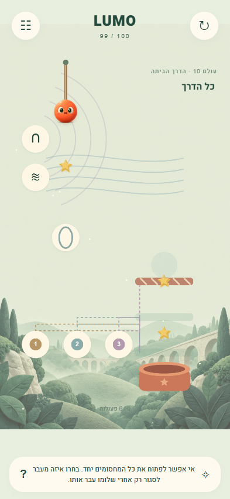
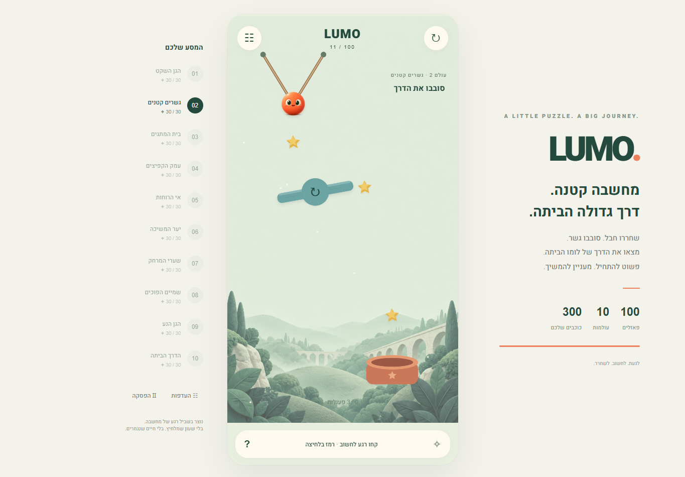

# LUMO — לומו

משחק פאזל פיזיקלי לשחקן יחיד, בעברית, המותאם למסך מגע ול־Android. 100 שלבים בעשרה עולמות, חבלים ותנופה, גשרים מסתובבים, מעגלי מתגים, מחסומים מתחלפים, קפיצים, רוח, מגנטים, שערים, כבידה ובית נע.





צילום ממכשיר Android פיזי: [Samsung Galaxy A73](docs/screenshots/android-device.png). קובצי ההתקנה זמינים ב־Releases. פרטי החתימה נמצאים ב־[docs/signing](docs/signing/README.md), ופרטי הגרסה ב־[Release notes](docs/RELEASE-NOTES.md).

## משחק

געו בחבל או החליקו עליו כדי לחתוך. געו בציר או במנגנון כדי לשנות את מצבו. המטרה היא להביא את לומו לקערה. במתגים, הקווים המקווקווים מראים אילו מחסומים משתנים. במחסומים מתחלפים צריך להעביר את לומו דרך הראשון לפני החלפה נוספת. שלבי תנופה דורשים שחרור של חבל אחד לפני השני.

כוכב אחד על השלמת השלב, כוכב נוסף על עמידה במספר הפעולות, וכוכב נוסף על איסוף שלושת הניצוצות. התקדמות נשמרת במכשיר, כולל התוצאה הטובה ביותר בכל שלב. מעבר לשלב הבא פותח את השלב הבא. אפשר לחזור לשלבים שהושלמו דרך המפה. Restart נמצא תמיד בראש המסך. רמזים זמינים בלחיצה על הכרטיס התחתון. אין הגבלת זמן או חיים.

## הפעלה ובנייה

```powershell
npm ci
npm run dev
npm test
npm run build
npm run preview
```

לבדיקת ממשק: התקינו Chromium באמצעות `npx playwright install chromium`, ואז הריצו `node tests/browser.mjs` כאשר שרת הפיתוח פועל. אפשר להגדיר `PLAYWRIGHT_EXECUTABLE` כדי להשתמש ב־Chromium מותקן. הבדיקה דורשת קודם `node tests/levels.mjs > level-results.json`.

התקנה בדפדפן Android דורשת פריסה ב־HTTPS. לאחר הטעינה והפעלת Service Worker, כל קובצי המשחק זמינים ללא חיבור. `localhost` מיועד לבדיקה במחשב; גישה לנייד דרך HTTP ברשת המקומית מאפשרת משחק, אך אינה מאפשרת התקנת PWA ועבודה ללא רשת.

לבניית Android:

```powershell
npm run android
cd android
.\gradlew.bat assembleDebug
```

נדרשים Java 21 ו־Android SDK 35 עם Build Tools 35.0.0. הגדירו `sdk.dir` בקובץ `android/local.properties` לפי המחשב שלכם. קובץ APK מתקבל ב־`android/app/build/outputs/apk/debug/app-debug.apk`. גרסת ההתקנה המקומית חתומה במפתח פיתוח; הפצה ב־Google Play דורשת מפתח חתימה בבעלות המפתח ובניית AAB.

## מבנה

- `src/levels.js`: הגדרות מאה השלבים, עולמות, מעגלי מתגים, יעד הפעולות ופתרונות ייחוס. הפתרונות משמשים לבדיקות, אינם מופעלים בזמן משחק.
- `src/physics.js`: Matter.js בצעד קבוע של 1/120 שנייה. אין הכוונה אוטומטית אל הבית ואין הצלחה המבוססת על אוסף לחיצות: לומו צריך להגיע פיזית ליעד.
- `src/draw.js`: ציור המנגנונים לפי הגאומטריה הפיזיקלית; איור רקע ודמות מקומיים.
- `src/main.js`: ממשק מגע, מפה, שמירה, רמזים, תוצאות, העדפות וגיבוי.
- `src/audio.js`: צלילי פעולה ואיסוף באמצעות Web Audio.
- `scripts/build-sw.mjs`: מטמון מלא של תוצר הבנייה להפעלה ללא רשת.
- `tests/levels.mjs`: פתרון פיזיקלי של כל מאה השלבים, כולל שלושה כוכבים ויעד של עד שש פעולות.
- `tests/browser.mjs`: בדיקות מגע, התקדמות, שמירה, מפה ושחזור כל הפתרונות בתוך דפדפן.

כדי להוסיף שלב, הוסיפו הגדרה בפרק המתאים, לרבות פתרון ייחוס. כדי להוסיף מנגנון, הוסיפו התנהגות ב־`Puzzle.interact`/`tick`, ציור ויעד מגע ב־`draw.js`, ואחר כך כיסוי בבדיקות. שמירה משתמשת במזהי שלבים יציבים: יש להוסיף שלבים בסוף ולהרחיב את אורך השמירה לפני שינוי הכמות.

## עיצוב ובדיקות

כיוון העיצוב נוצר בכלי Image Gen המובנה: משטח מנטה ושמנת, לומו כתום מחומר רך, ניצוצות זהב, גשר ירקרק וקערת טרקוטה. תמונת הקונספט נמצאת ב־`C:/Users/user/.codex/generated_images/01a107f8-c262-72f0-8751-2777f1ab5f0d/exec-1253ddfe-dc6f-4818-85ad-5108cdb471b4.png`. נכסי המשחק הסופיים הם `public/garden.png` ו־`public/lumo.png`.

המראה נבדק בדפדפן המובנה ובצילומי Chromium בגודל נייד 393×852 ושולחן עבודה 1365×950. תוקנו: חפיפת כותרת וחבל, עיוות יחס התצוגה בנייד, אי־התאמה בין אורך הגשר לצורת ההתנגשות, גודל כפתור הסיבוב, תלות הגופן ברשת, ורווח קטן מדי בין מחסומים מתחלפים. התאמות מכוונות לקונספט: ממשק עברי, מנגנונים מצוירים בקוד כדי להתאים לפיזיקה, ומסגרת צדדית במחשב.

בדיקות אוטומטיות מאמתות מסלולים ופעולות. מידת האתגר לאדם בוגר, קצב הלמידה לילדים ומשוב רטט במכשירים שונים מחייבים גם בדיקות משחק על מכשירים ובקרב שחקנים; אין להסיק אותן מעצם הצלחת פתרונות הייחוס.
